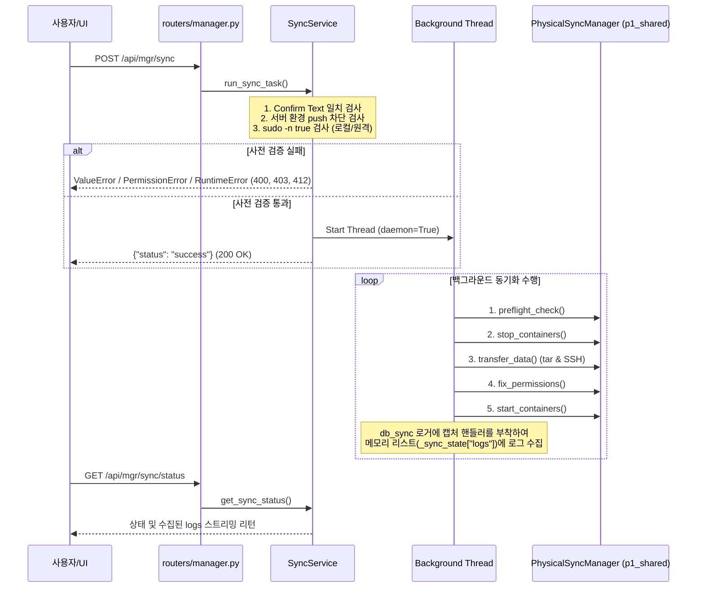

# 물리 동기화 및 감사 리포팅 API (physical_sync.md)

> **상태**: ✅ 구현 완료 (T-010)
> **최근 업데이트**: 2026-06-11
> **소스 파일**: 
> - [manager.py](file:///home/roid2/pjt/nf3/01_nf3_tdms/tdms_core/p4_manager/routers/manager.py)
> - [sync_service.py](file:///home/roid2/pjt/nf3/01_nf3_tdms/tdms_core/p4_manager/services/sync_service.py)

---

## 1. 개요
개발 PC와 원격 서버 PC 간에 데이터 손실 없이 대용량 TimescaleDB 물리 볼륨 데이터 스냅샷을 원격 SSH 복제하는 파이프라인 제어 및 진행 상황 감사 리포팅 API 세트입니다.
안전장치로 운영 서버(server 환경)에서의 Push(쓰기 수신) 동작이 원천 차단되며, 무인화를 위한 NOPASSWD 설정 사전 점검 및 예외 처리가 포함되어 있습니다.

---

## 2. API Endpoints 명세

### 2.1. DB 물리 동기화 태스크 백그라운드 기동
- **Method & Path**: `POST /api/mgr/sync`
- **Request Body (JSON)**:
  ```json
  {
    "market": "kdms",       // "kdms" 또는 "usdms"
    "direction": "pull",    // "pull" (서버->로컬) 또는 "push" (로컬->서버)
    "confirm_text": "PULL FROM SERVER" // "PULL FROM SERVER" 또는 "PUSH TO SERVER" (이중 안전장치)
  }
  ```
- **Response (200 OK)**:
  ```json
  {
    "status": "success",
    "message": "KDMS physical sync task started in background"
  }
  ```
- **에러 응답**:
  - `400 Bad Request`: `confirm_text`가 일치하지 않거나 지원하지 않는 동기화 파라미터인 경우
  - `403 Forbidden`: `detect() == "server"` 인 환경에서 `direction == "push"` 쓰기 수신을 시도하는 경우 (서버 데이터 보호)
  - `412 Precondition Failed`: 로컬 또는 원격 서버의 `/etc/sudoers.d/tdms_sync`에 패스워드 없는 sudo (`NOPASSWD`) 권한이 부여되지 않은 경우 (가이드라인 포함 리턴)
  - `500 Internal Server Error`: 이미 백그라운드 스레드가 구동 중이거나 시스템적인 문제 발생 시

### 2.2. 백그라운드 동기화 상태 및 실시간 로그 버퍼 조회
- **Method & Path**: `GET /api/mgr/sync/status`
- **Response (200 OK)**:
  ```json
  {
    "status": "RUNNING",  // "IDLE", "RUNNING", "SUCCESS", "ERROR"
    "logs": [
      "2026-06-11 17:00:00 [INFO] 동기화 기동 준비: market=kdms, direction=pull, peer_ip=192.168.35.176",
      "2026-06-11 17:00:02 [INFO] 1. Preflight 점검 중...",
      "2026-06-11 17:00:03 [INFO]    - SSH 접속 정상"
    ],
    "error_message": ""  // 에러 발생 시의 상세 문구
  }
  ```

### 2.3. 물리 동기화 결과 정밀 감사 리포팅
동기화가 성공적으로 끝난 뒤 양측의 수집 일관성(Gaps/Null/Outlier)을 최종 검증하기 위해 로컬/원격에서 감사를 독립 기동 및 리포팅합니다.
- **Method & Path**: `POST /api/mgr/sync/audit?market=kdms`
- **Query Parameter**:
  - `market`: "kdms" 또는 "usdms"
- **Response (200 OK)**:
  ```json
  {
    "status": "success",
    "market": "kdms",
    "audit_type": "audit_deep",
    "raw_output": "...[INFO] Verifying ECOS API Gaps... Gaps checked: 0..."
  }
  ```

---

## 3. 핵심 인터페이스 및 데이터 흐름



---

## 4. 무인화 설정 사전 필수 등록
물리 동기화 도중 Docker 컨테이너 중지, tar 압축, 원격 소유권 복구 등은 root 권한이 필수적입니다. 무인 백그라운드 수행 시 패스워드 입력 프롬프트 블로킹을 우회하기 위해 **로컬 개발 PC와 원격 서버 PC 모두** 아래 설정이 선행되어야 합니다.
- **설정 파일**: `/etc/sudoers.d/tdms_sync`
- **등록 내용**:
  ```bash
  # 예: roid2 계정에 대해 패스워드 검증 없이 아래 필수 권한 부여
  roid2 ALL=(ALL) NOPASSWD: /usr/bin/tar, /usr/bin/rm, /usr/bin/chown, /usr/bin/docker
  ```
